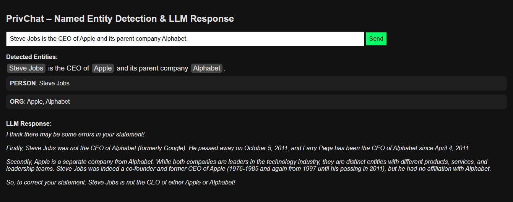
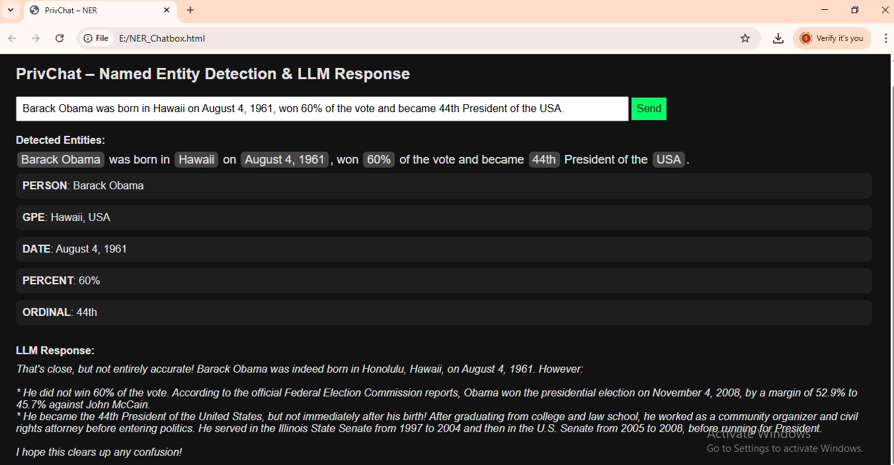

# PrivChat – Named Entity Recognition with Local LLM

This project is a lightweight NLP chat application that highlights named entities (e.g., PERSON, ORG, DATE, GPE) from user input using spaCy NER and generates intelligent responses using a locally hosted LLM via Ollama.

---

## 📂 Project Files

- `main.py` – FastAPI backend to process user prompts, extract named entities, and get LLM responses
- `NER_Chatbox.html` – Frontend chat UI that sends prompts, highlights named entities, and shows LLM replies

---

## ⚙️ Requirements

- Python 3.8+
- spaCy
- FastAPI
- Uvicorn
- requests
- Ollama (with models like `llama3`, `gemma`, etc.)

---

## 🧪 Installation Steps

### 1. Clone the Repository / Extract the Folder
Place both files in the same project folder:
```
NER_Chatbox.html
main.py
```

### 2. Create and Activate a Virtual Environment (Optional but Recommended)
```bash
python -m venv venv
venv\Scripts\activate     # Windows
# OR
source venv/bin/activate    # macOS/Linux
```

### 3. Install Required Python Packages
```bash
pip install fastapi uvicorn spacy requests
python -m spacy download en_core_web_sm
```

### 4. Install Ollama and Run the Model
- Download and install Ollama: [https://ollama.com/download](https://ollama.com/download)
- Start the model:
```bash
ollama run gemma3:1b
```

> ✅ Keep this terminal running. This serves your local LLM at port `11434`.

---

## 🚀 Running the Application

### 1. Start FastAPI Server
In a new terminal window/tab (same folder as `main.py`):

```bash
uvicorn main:app --reload
```

Expected output:
```
INFO:     Uvicorn running on http://127.0.0.1:8000
```

### 2. Open the Frontend
- Double-click on `NER_Chatbox.html`
- Or open it in a browser using "Live Server" if you're using VS Code

---

## 💡 How It Works

1. User types a prompt in the chatbox.
2. The frontend sends the prompt to FastAPI (`/process` endpoint).
3. FastAPI:
   - Extracts named entities using `en_core_web_sm`
   - Queries the LLM using Ollama's REST API (streamed response)
4. The frontend:
   - Highlights detected entities in the prompt
   - Groups and displays them by type
   - Shows the LLM response

---

## 📸 Example Inputs

- **Prompt**: `Mark Zuckerberg founded Facebook and Meta in California.`
- **NER Output**:
  ```
  PERSON: Mark Zuckerberg
  ORG: Facebook, Meta
  GPE: California
  ```
- **LLM Response**: _(Generated locally using llama3 or gemma)_

---

## 📸 Screenshots

### Example 1


### Example 2


---

## 🛑 Stopping the Application

- To stop FastAPI: `Ctrl + C`
- To stop Ollama: `Ctrl + C` in the terminal running the model or kill the `ollama.exe` process

---

## ✨ Notes

- Make sure Ollama is running before sending prompts
- The HTML communicates with the backend using `http://localhost:8000/process/`

---